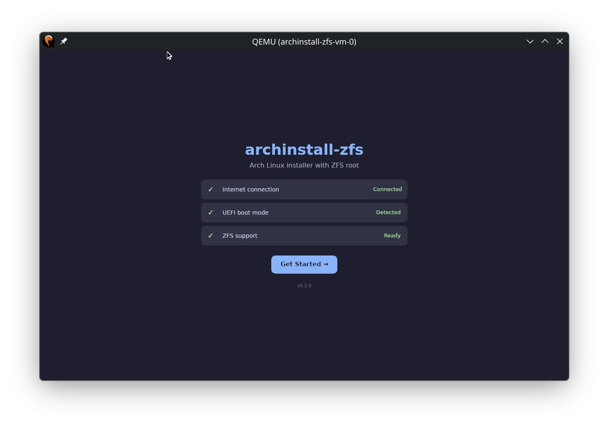
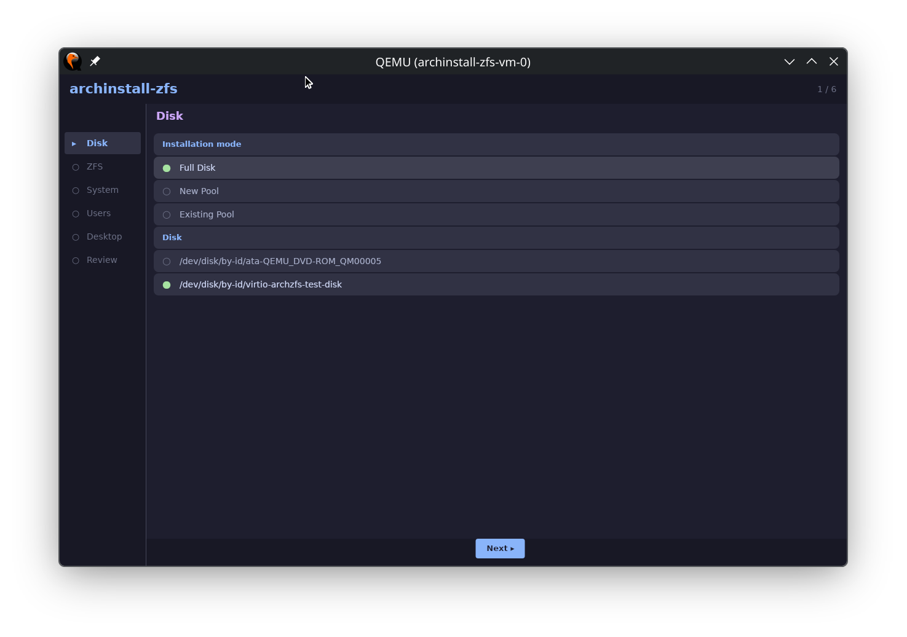
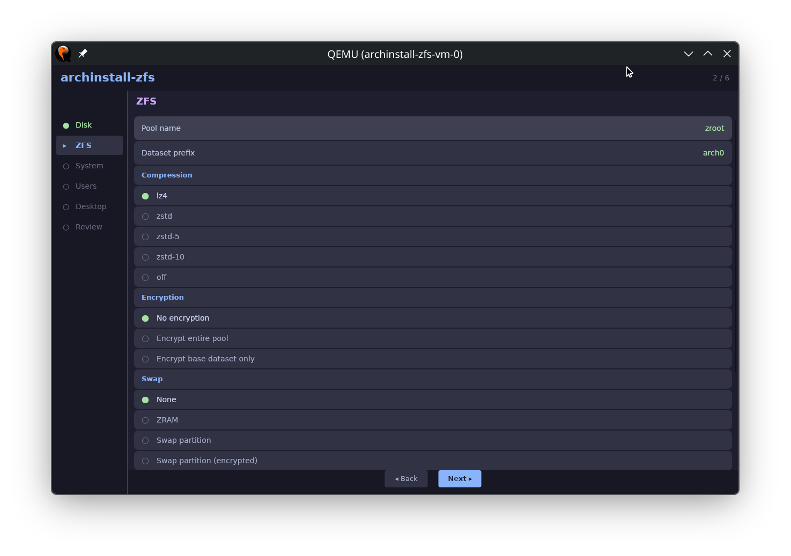
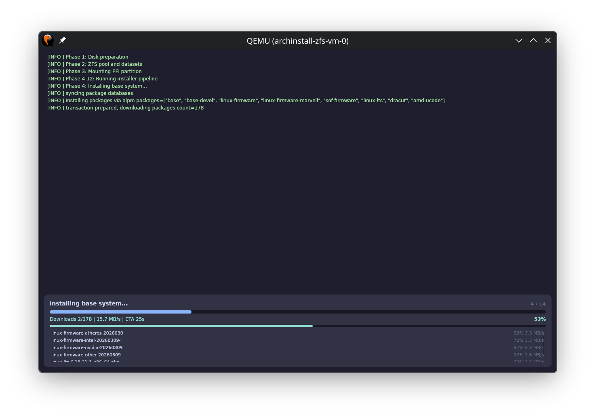
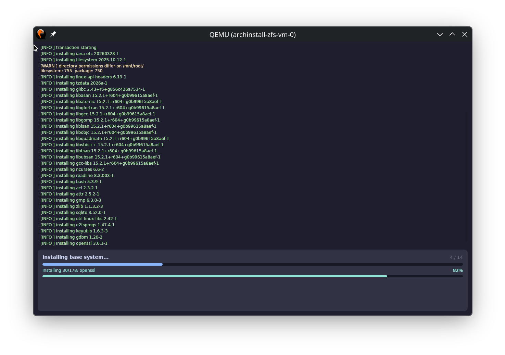
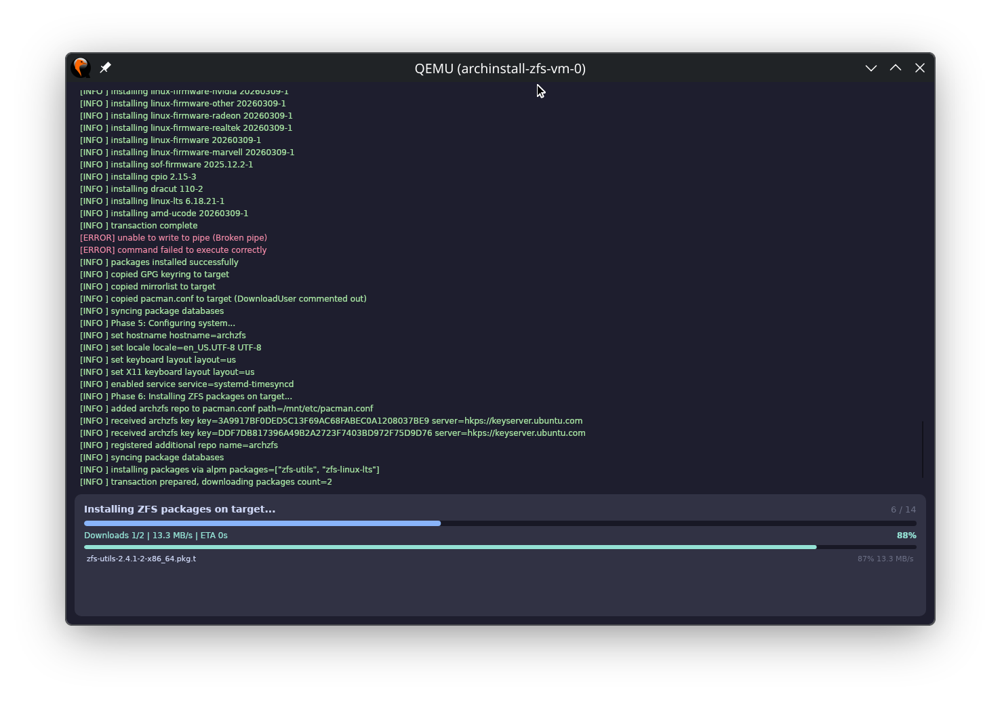
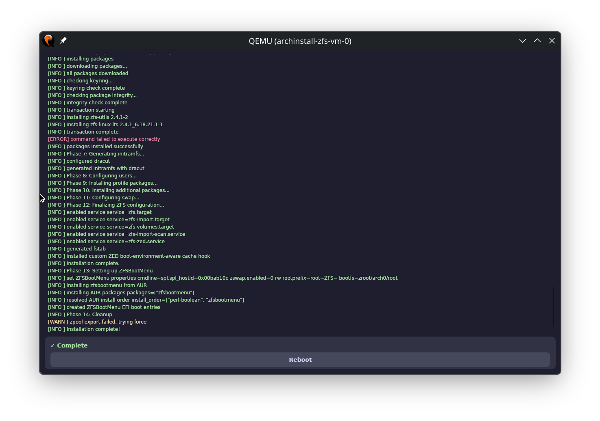

<h1 align="center">Archinstall‑ZFS 🚀🦀</h1>

> ZFS-first Arch Linux installer with ZFSBootMenu and a step-by-step wizard UI.

[](https://github.com/okhsunrog/archinstall_zfs/blob/main/LICENSE)
[](https://github.com/okhsunrog/archinstall_zfs/releases)
[](https://github.com/okhsunrog/archinstall_zfs/actions)

> [!NOTE]
> This is a complete rewrite in Rust. The previous Python version is preserved on the [`old_python`](https://github.com/okhsunrog/archinstall_zfs/tree/old_python) branch.

<p align="center">
  
</p>

---

## Overview

Setting up ZFS on Arch involves kernel selection, ZFS module installation, bootloader configuration, and optional encryption. Archinstall-ZFS automates these steps with a wizard-style TUI and an experimental Slint GUI. It uses direct libalpm bindings for package management (no `pacman`/`pacstrap` shell calls), resolves AUR dependency chains via `raur`/`aur-depends`, and validates kernel/ZFS compatibility against OpenZFS release data.

Key improvements over the Python version:

- **No archinstall dependency** — fully standalone, no dependency on the official Arch installer framework or its Python ecosystem
- **Single binary** with no Python/pip/venv dependencies
- **Direct libalpm** for all package management with async parallel downloads and per-package progress
- **No external package manager binaries** needed at runtime (no `pacman`, `pacstrap`, `yay`)
- **Proper AUR dependency resolution** via `raur` + `aur-depends` crates
- **Cancellable installation** with graceful cleanup
- **Trace-level file logging** (`/tmp/archinstall-zfs.log`) for post-mortem analysis

### Screenshots

| Disk selection | ZFS configuration | Download progress |
|:-:|:-:|:-:|
|  |  |  |

| Package installation | ZFS on target | Installation complete |
|:-:|:-:|:-:|
|  |  |  |

---

## Quick start

### Option A: Prebuilt ISO (recommended)
1. Download the latest ISO from the [releases page](https://github.com/okhsunrog/archinstall_zfs/releases).
2. Boot on a UEFI machine and connect to the network.
   > **Ventoy users**: When selecting the image, choose GRUB2 boot mode for proper UEFI booting.
3. Run:

```bash
archinstall-zfs
```

> Why recommended: the ISO already contains ZFS components and the installer, so startup is faster and avoids on-the-fly package installation.

### Option B: Official Arch ISO
```bash
# Boot the official Arch ISO and connect to the network
# Download the binary from releases, or build from source:
pacman -Sy git base-devel
git clone --depth 1 https://github.com/okhsunrog/archinstall_zfs
cd archinstall_zfs
cargo build --release -p archinstall-zfs-tui
./target/release/archinstall-zfs-tui
```

> Note: This path installs ZFS components during the run, so it usually takes longer than Option A.

### Silent mode (for automation)
```bash
archinstall-zfs --config config.json --silent
```

---

## Features

### Device naming: uses `/dev/disk/by-id` for stable device references.

### Installation modes

| Mode | Description | Best for |
|------|-------------|----------|
| **Full Disk** | Complete disk takeover with automated partitioning. Clears GPT/MBR signatures, creates fresh GPT table, partitions (EFI 500MB, optional swap, remainder for ZFS) | Clean installs, single-purpose machines, maximum automation |
| **New Pool** | Creates ZFS pool on an existing partition. Uses your existing partition layout, creates ZFS pool on selected partition | Dual-boot scenarios, custom partitioning schemes, preserving existing OS installations |
| **Existing Pool** | Installs into an existing ZFS pool as a new boot environment. Creates new BE datasets within your existing pool structure | Experiments, testing different configurations, multiple Arch installations |

> **Pro tip**: Existing Pool mode is excellent for trying different desktop environments or system configurations without risk — each installation becomes its own boot environment selectable from ZFSBootMenu.

### Kernel support
- `linux-lts` + `zfs-linux-lts`
- `linux` + `zfs-linux`
- `linux-zen` + `zfs-linux-zen`
- `linux-hardened` + `zfs-linux-hardened`

> All kernel options automatically fall back to `zfs-dkms` if precompiled modules are unavailable.

### Kernel/ZFS compatibility validation

One of the key challenges with ZFS on Arch is compatibility between kernel versions and ZFS modules. The installer includes a validation system that:

- **Parses OpenZFS releases**: Checks https://github.com/openzfs/zfs/releases for supported kernel version ranges
- **Validates current packages**: Cross-references with actual kernel versions available in Arch repositories
- **Checks precompiled availability**: Determines if precompiled ZFS modules exist for your chosen kernel
- **Assesses DKMS feasibility**: Analyzes whether DKMS compilation will work with bleeding-edge kernels
- **Downloads archzfs.db directly**: Falls back to the archzfs package database when the repo isn't configured locally
- **Provides smart fallbacks**: Automatically suggests compatible alternatives when conflicts are detected

The validation runs in two places:
1. **In the TUI/GUI** — shows compatibility status (`[OK]`/`[INCOMPATIBLE]`) next to each kernel
2. **Before installation** — warns about potential issues in Phase 0

### Encryption options
- Pool-wide encryption (all datasets inherit)
- Per-boot environment encryption (encrypts the base dataset)
- No encryption

### Swap and memory management

**No swap + ZRAM (recommended)**: Compressed swap in RAM via `systemd-zram-generator`. Default size: `min(ram / 2, 4096)` MB. zswap is disabled to avoid double compression.

**Swap partition**: Dedicated partition with zswap enabled. Supports encryption via `cryptswap` in `/etc/crypttab`.

**No swap**: Pure RAM-only operation.

> Swap on ZFS (zvol/swapfile) is not supported due to potential deadlock issues. Hibernation is not currently supported.

### Boot environments and layout

Boot Environments (BE) are a way to maintain multiple independent systems on a single ZFS pool. Each system is housed in its own root dataset and can be selected at boot through ZFSBootMenu.

ZFSBootMenu is a bootloader designed specifically for ZFS. Unlike traditional bootloaders, it natively understands ZFS structure and can display boot environments in a menu, create snapshots, and clone boot environments directly at boot time.

#### Dataset structure

```
pool/prefix/root       → /          (root filesystem, canmount=noauto)
pool/prefix/data/home  → /home      (user data)
pool/prefix/data/root  → /root      (root user data)
pool/prefix/vm         → /vm        (virtual machines)
```

ZFSBootMenu is built locally via `generate-zbm` (AUR package) with a pacman hook for automatic regeneration on kernel updates.

#### Cross-environment mount prevention

A custom ZED hook (`history_event-zfs-list-cacher.sh`) ensures only the current boot environment's datasets are mounted, preventing cross-environment mount conflicts. It is installed to `/etc/zfs/zed.d/` and marked immutable (`chattr +i`) to survive ZFS package updates.

### AUR packages
- Resolves full AUR-to-AUR dependency chains via `raur` + `aur-depends`
- Builds using a temporary user (`aurinstall`) with temporary passwordless sudo
- Cleans up temp user and build artifacts after installation

### Snapshot management (optional)
- zrepl support for automatic snapshot creation and retention
- Schedules: 15-minute intervals with tiered retention (4x15m, 24x1h, 3x1d)
- Generates configuration based on your pool and dataset prefix

---

## Architecture

```
archinstall_zfs/
  core/       # Library crate — all installation logic, config, validation
  tui/        # ratatui-based terminal UI (wizard-style, 7 steps)
  slint-ui/   # Slint GUI (Linux KMS backend, wizard-style)
  xtask/      # Development tasks (QEMU testing, ISO building)
  gen_iso/    # ISO building templates and scripts
```

### Package management

All package installation uses direct libalpm bindings (`alpm` crate):

- `AlpmContext::for_host()` — installs packages on the live ISO
- `AlpmContext::for_target()` — installs packages into the target chroot
- `TargetMounts` — manages API filesystem mounts (proc/sys/dev) matching pacstrap's `chroot_setup()`
- Async download engine with parallel downloads, per-package progress, SHA256 verification, and mirror failover

The only remaining shell calls are:
- `pacman-key` for GPG keyring operations (no libalpm equivalent)
- `makepkg` for building AUR packages (bash script by design)
- `chroot_cmd` for non-package chroot commands

---

## Development

### Prerequisites
- Arch Linux (for libalpm headers)
- Rust 2024 edition
- `just` (task runner)

### Common commands
```bash
just build          # Build release binaries
just test           # Run cargo tests
just lint           # Run clippy
just fmt            # Format code

just build-test     # Build testing ISO
just test-vm        # Full cycle: fresh disk, install, boot, verify (13 checks)
just test-install   # Install only
just test-boot      # Boot and verify existing installation

just qemu-install   # Boot ISO in QEMU with GUI
just ssh            # SSH into running QEMU VM
just upload         # Upload binaries to running VM
```

### Testing
The xtask test suite boots a QEMU VM, runs the installer, reboots from the installed disk, and verifies 13 system health checks (kernel, ZFS pool, sshd, fstab, initramfs, zram, mounts, hostid, ZED hook, bootfs, rootprefix, ZBM build, ZBM pacman hook).

Installer logs are automatically pulled from the VM to `test-install.log` for analysis.

---

## Troubleshooting

<details>
<summary><strong>ZFS package dependency issues</strong></summary>

If a precompiled ZFS package for your exact kernel version is not available, the installer automatically falls back to DKMS. The kernel compatibility validation reduces the chance of encountering build failures.

</details>

<details>
<summary><strong>Installation fails in QEMU</strong></summary>

Common causes:
- UEFI not enabled in VM settings
- Insufficient RAM (< 2GB)
- No network connectivity

Tips:
1. Use `just qemu-install-serial` for better error visibility
2. Check `test-install.log` for detailed trace-level logs
3. Verify UEFI firmware is loaded

</details>

<details>
<summary><strong>Boot issues after installation</strong></summary>

If ZFSBootMenu does not appear:
1. Check UEFI boot order in firmware
2. Verify the EFI partition is mounted
3. Confirm ZFSBootMenu files exist in `/boot/efi/EFI/ZBM/`

Recovery: Boot from the installer USB and run repair commands via chroot.

</details>

---

## Links

### Articles
- [Meet archinstall_zfs: The TUI That Tames Arch Linux ZFS Installation](https://okhsunrog.dev/posts/archinstall-zfs/) (English)
- [Arch Linux on ZFS for humans: archinstall_zfs](https://habr.com/ru/articles/942396/) (Habr, Russian)
- [Arch Linux on ZFS for humans: archinstall_zfs](https://okhsunrog.dev/ru/posts/archinstall-zfs/) (Russian)

### Resources
- [Arch Wiki: ZFS](https://wiki.archlinux.org/title/ZFS)
- [Arch Wiki: Install Arch Linux on ZFS](https://wiki.archlinux.org/title/Install_Arch_Linux_on_ZFS)
- [ZFSBootMenu: Boot Environments and You](https://docs.zfsbootmenu.org/en/v2.3.x/general/bootenvs-and-you.html)
- [OpenZFS Documentation](https://openzfs.github.io/openzfs-docs/)

---

## License

GPL-3.0 — see [`LICENSE`](LICENSE).
