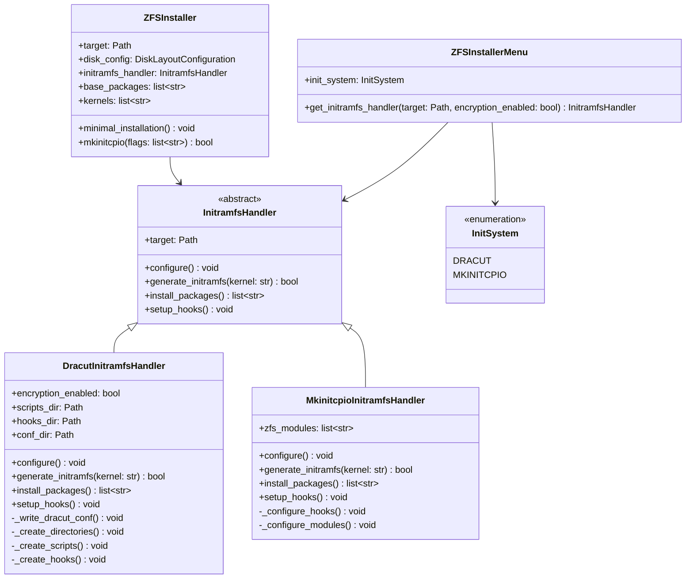

# Initramfs Handler Architecture Design

## Overview

This document describes a better architecture for handling initramfs systems (dracut vs mkinitcpio) in the ZFS installer. The goal is to create a clean, extensible system that properly integrates with archinstall's workflow while allowing flexible selection of initramfs tools.

## Current Issues

1. **Conflicting initramfs tools**: The code adds "dracut" to base packages while archinstall tries to run mkinitcpio
2. **Improper integration**: Separate configuration of dracut doesn't integrate well with archinstall's workflow
3. **Hardcoded package lists**: Package selection doesn't adapt to initramfs choice
4. **Lack of abstraction**: No clean separation between initramfs tool configuration and installation logic

## Proposed Architecture

### Class Diagram



## Implementation Details

### 1. Base Initramfs Handler Class

```python
from abc import ABC, abstractmethod
from pathlib import Path

class InitramfsHandler(ABC):
    """Abstract base class for initramfs handlers."""
    
    def __init__(self, target: Path):
        self.target = target
    
    @abstractmethod
    def configure(self) -> None:
        """Configure the initramfs system."""
        pass
    
    @abstractmethod
    def generate_initramfs(self, kernel: str) -> bool:
        """Generate initramfs for a specific kernel."""
        pass
    
    @abstractmethod
    def install_packages(self) -> list[str]:
        """Return list of packages needed for this initramfs system."""
        pass
    
    @abstractmethod
    def setup_hooks(self) -> None:
        """Set up hooks for automatic initramfs regeneration."""
        pass
```

### 2. Dracut Implementation

The Dracut implementation will be based on the existing `DracutSetup` class but will be extended to fully implement the `InitramfsHandler` interface.

### 3. Mkinitcpio Implementation

A new `MkinitcpioInitramfsHandler` class will be created to handle mkinitcpio configuration, including ZFS-specific hooks and modules.

### 4. ZFS Installer Modifications

The `ZFSInstaller` class will be modified to:

1. Accept an `InitramfsHandler` instance in its constructor
2. Use the handler's `install_packages()` method to determine required packages
3. Override the `mkinitcpio()` method to delegate to the handler's `generate_initramfs()` method
4. Call the handler's `setup_hooks()` method during installation

### 5. Menu Integration

The `ZFSInstallerMenu` will be updated to:

1. Pass the selected init system to the installer
2. Create the appropriate `InitramfsHandler` instance based on user selection

### 6. Main Installation Flow

The main installation flow in `main.py` will be updated to:

1. Get the initramfs choice from the menu
2. Create the appropriate `InitramfsHandler` instance
3. Pass it to the `ZFSInstaller` constructor
4. Remove the separate dracut configuration step

## Benefits of This Approach

1. **Clean separation of concerns**: Initramfs configuration is separated from installation logic
2. **Extensibility**: Adding new initramfs tools is straightforward
3. **Proper integration**: Works correctly with archinstall's workflow
4. **Flexibility**: Users can choose their preferred initramfs tool
5. **Maintainability**: Each initramfs tool has its own dedicated handler class