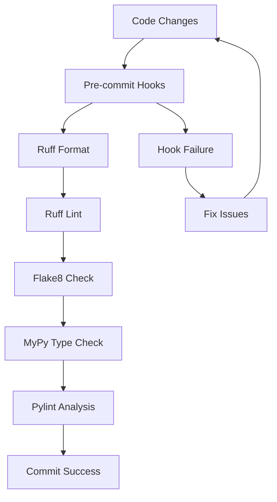
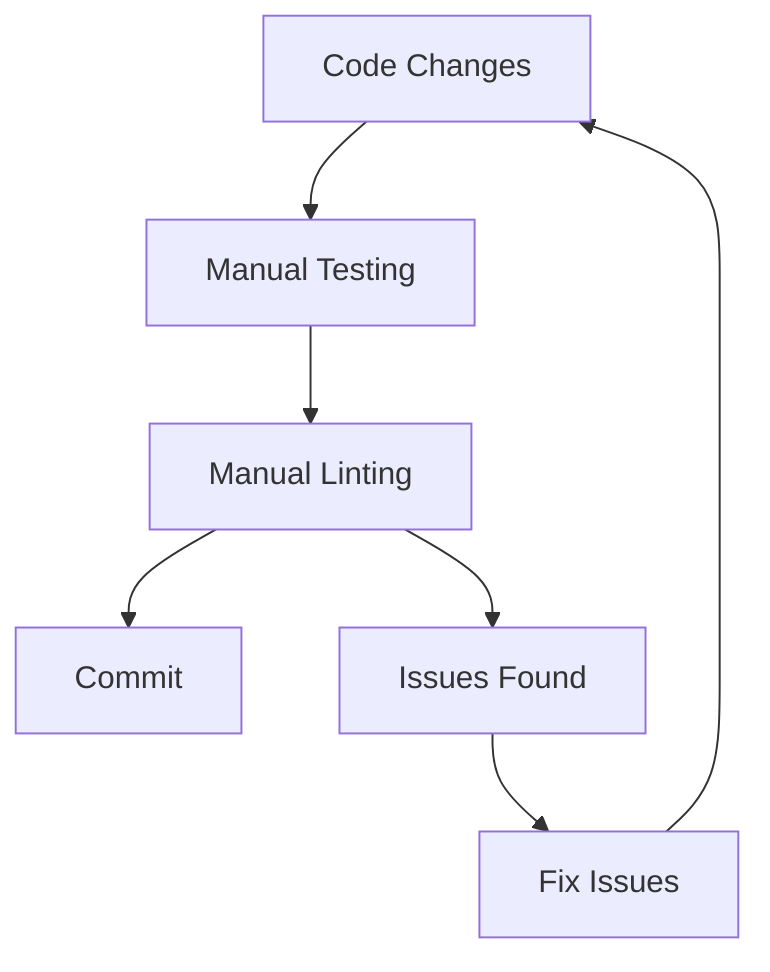
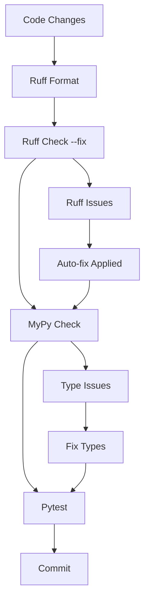

# Python Code Quality Tools Guide

This guide provides a comprehensive overview of Python code quality tools used in the archinstall and archinstall_zfs projects, along with best practices and migration recommendations.

## Table of Contents

1. [Tool Overview](#tool-overview)
2. [Project Comparison](#project-comparison)
3. [Tool Configurations](#tool-configurations)
4. [Development Workflow](#development-workflow)
5. [Migration Guide](#migration-guide)
6. [Best Practices](#best-practices)
7. [Modern Rust-Based Tools](#modern-rust-based-tools)
8. [Simplified Toolchain Recommendation](#simplified-toolchain-recommendation)
9. [Setup Instructions](#setup-instructions)

## Tool Overview

### Core Quality Tools

| Tool | Purpose | archinstall | archinstall_zfs |
|------|---------|-------------|-----------------|
| **MyPy** | Static type checking | ✅ Comprehensive | ✅ Basic |
| **Flake8** | Style guide enforcement | ✅ With pre-commit | ✅ Standalone |
| **Pylint** | Code analysis | ✅ With plugins | ✅ Basic |
| **Ruff** | Fast Python linter/formatter | ✅ Full setup | ❌ Not used |
| **Black** | Code formatter | ❌ (uses Ruff) | ✅ Basic |
| **Bandit** | Security linter | ✅ Configured | ❌ Not used |
| **Pre-commit** | Git hooks | ✅ Full setup | ❌ Not used |
| **Pytest** | Testing framework | ✅ Configured | ✅ Basic |

## Project Comparison

### archinstall Project (Comprehensive Setup)

**Strengths:**
- Pre-commit hooks for automated quality checks
- Ruff for fast linting and formatting
- Comprehensive MyPy configuration with strict typing
- Security scanning with Bandit
- Extensive rule customization
- CI/CD integration ready

**Configuration Files:**
- `pyproject.toml` - Main configuration
- `.flake8` - Flake8 specific settings
- `.pre-commit-config.yaml` - Git hooks

### archinstall_zfs Project (Simple Setup)

**Strengths:**
- Lightweight and easy to understand
- Basic coverage of essential tools
- Quick setup for small projects

**Limitations:**
- No automated quality checks
- Missing security scanning
- Basic MyPy configuration
- No pre-commit hooks

## Tool Configurations

### MyPy Configuration

#### archinstall (Advanced)
```toml
[tool.mypy]
python_version = "3.12"
files = "."
exclude = "^build/"
disallow_any_explicit = false
disallow_any_expr = false
disallow_any_unimported = true
enable_error_code = [
    "deprecated",
    "explicit-override",
    "ignore-without-code",
    "mutable-override",
    "possibly-undefined",
    "redundant-expr",
    "redundant-self",
    "truthy-bool",
    "truthy-iterable",
    "unimported-reveal",
    "unused-awaitable",
]
show_traceback = true
strict = true
warn_unreachable = true

# Module-specific overrides for different strictness levels
[[tool.mypy.overrides]]
module = "archinstall.default_profiles.*"
disallow_any_explicit = true
```

#### archinstall_zfs (Basic)
```toml
[tool.mypy]
exclude = ['archinstall/.*']
ignore_missing_imports = true
namespace_packages = true
explicit_package_bases = true
mypy_path = "."
```

### Flake8 Configuration

#### archinstall
```ini
[flake8]
count = True
ignore = W191,W503,E704,E203
max-complexity = 40
max-line-length = 160
show-source = True
statistics = True
exclude = .git,__pycache__,build,docs,actions-runner
```

#### archinstall_zfs
```ini
[flake8]
count = True
ignore = W191,W503
max-complexity = 40
max-line-length = 160
show-source = True
statistics = True
builtins = _
per-file-ignores = __init__.py:E128,F401
exclude = .git,__pycache__,build,docs,actions-runner
```

### Ruff Configuration (archinstall only)

```toml
[tool.ruff]
target-version = "py312"
line-length = 160

[tool.ruff.format]
indent-style = "tab"
quote-style = "single"
docstring-code-format = true

[tool.ruff.lint]
select = [
    "ASYNC",  # flake8-async
    "B",      # flake8-bugbear
    "C90",    # mccabe
    "COM",    # flake8-commas
    "DTZ",    # flake8-datetimez
    "E",      # pycodestyle errors
    "EXE",    # flake8-executable
    "F",      # Pyflakes
    "FA",     # flake8-future-annotations
    "FLY",    # flynt
    "G",      # flake8-logging-format
    "I",      # isort
    "ICN",    # flake8-import-conventions
    "ISC",    # flake8-implicit-str-concat
    "LOG",    # flake8-logging
    "PGH",    # pygrep-hooks
    "PIE",    # flake8-pie
    "PLC",    # Pylint conventions
    "PLE",    # Pylint errors
    "PLW",    # Pylint warnings
    "PYI",    # flake8-pyi
    "RSE",    # flake8-raise
    "RUF",    # Ruff-specific rules
    "SLOT",   # flake8-slot
    "T10",    # flake8-debugger
    "UP",     # pyupgrade
    "W",      # pycodestyle warnings
    "YTT",    # flake8-2020
]

ignore = [
    "B006",     # mutable-argument-default
    "B008",     # function-call-in-default-argument
    "B904",     # raise-without-from-inside-except
    "B905",     # zip-without-explicit-strict
    "B909",     # loop-iterator-mutation
    "COM812",   # missing-trailing-comma
    "PLC0415",  # import-outside-top-level
    "PLC1901",  # compare-to-empty-string
    "PLW1514",  # unspecified-encoding
    "PLW1641",  # eq-without-hash
    "PLW2901",  # redefined-loop-name
    "RUF005",   # collection-literal-concatenation
    "RUF015",   # unnecessary-iterable-allocation-for-first-element
    "RUF039",   # unraw-re-pattern
    "RUF051",   # if-key-in-dict-del
    "UP037",    # quoted-annotation
    "W191",     # tab-indentation
]

[tool.ruff.lint.mccabe]
max-complexity = 40
```

## Development Workflow

### archinstall Workflow (Recommended)



### archinstall_zfs Workflow (Current)



## Migration Guide

### Step 1: Update Dependencies

**Current archinstall_zfs dependencies:**
```toml
[project.optional-dependencies]
dev = [
    "pylint>=3.3.3",
    "mypy>=1.14.0",
    "flake8>=7.1.1",
    "black>=24.10.0",
    "pytest>=7.0.0",
]
```

**Recommended upgrade:**
```toml
[project.optional-dependencies]
dev = [
    "mypy==1.17.1",
    "flake8==7.3.0",
    "pre-commit==4.2.0",
    "ruff==0.12.7",
    "pylint==3.3.7",
    "pylint-pydantic==0.3.5",
    "pytest==8.4.1",
    "bandit>=1.7.0",
]
```

### Step 2: Add Pre-commit Configuration

Create `.pre-commit-config.yaml`:
```yaml
default_stages: ['pre-commit']
repos:
  - repo: https://github.com/astral-sh/ruff-pre-commit
    rev: v0.12.7
    hooks:
      - id: ruff
        args: ["--extend-select", "I", "--fix"]
      - id: ruff-format
      - id: ruff
  - repo: https://github.com/pre-commit/pre-commit-hooks
    rev: v5.0.0
    hooks:
    - id: check-added-large-files
      args: ['--maxkb=5000']
    - id: check-merge-conflict
    - id: check-symlinks
    - id: check-yaml
    - id: destroyed-symlinks
    - id: detect-private-key
    - id: check-ast
    - id: check-docstring-first
  - repo: https://github.com/pycqa/flake8
    rev: 7.3.0
    hooks:
    - id: flake8
      args: [--config=.flake8]
      fail_fast: true
  - repo: https://github.com/pre-commit/mirrors-mypy
    rev: v1.17.1
    hooks:
    - id: mypy
      args: ['--config-file=pyproject.toml']
      fail_fast: true
  - repo: local
    hooks:
      - id: pylint
        name: pylint
        entry: pylint
        language: system
        types: [python]
        fail_fast: true
        require_serial: true
```

### Step 3: Enhance MyPy Configuration

Replace the basic MyPy config with:
```toml
[tool.mypy]
python_version = "3.13"
files = "."
exclude = "^build/"
disallow_any_explicit = false
disallow_any_expr = false
disallow_any_unimported = true
enable_error_code = [
    "deprecated",
    "explicit-override",
    "ignore-without-code",
    "mutable-override",
    "possibly-undefined",
    "redundant-expr",
    "redundant-self",
    "truthy-bool",
    "truthy-iterable",
    "unimported-reveal",
    "unused-awaitable",
]
show_traceback = true
strict = true
warn_unreachable = true
```

### Step 4: Add Ruff Configuration

Add to `pyproject.toml`:
```toml
[tool.ruff]
target-version = "py313"
line-length = 160

[tool.ruff.format]
indent-style = "space"
quote-style = "double"
docstring-code-format = true

[tool.ruff.lint]
select = [
    "ASYNC", "B", "C90", "COM", "DTZ", "E", "EXE", "F", "FA", "FLY",
    "G", "I", "ICN", "ISC", "LOG", "PGH", "PIE", "PLC", "PLE", "PLW",
    "PYI", "RSE", "RUF", "SLOT", "T10", "UP", "W", "YTT",
]

ignore = [
    "B006", "B008", "B904", "B905", "B909", "COM812", "PLC0415",
    "PLC1901", "PLW1514", "PLW1641", "PLW2901", "RUF005", "RUF015",
    "RUF039", "RUF051", "UP037",
]

[tool.ruff.lint.mccabe]
max-complexity = 40
```

### Step 5: Add Security Scanning

Add Bandit configuration:
```toml
[tool.bandit]
targets = ["archinstall_zfs"]
exclude = ["/tests"]
```

### Step 6: Remove Black (Replace with Ruff)

Remove Black from dependencies and configuration, as Ruff provides faster formatting.

## Best Practices

### 1. Tool Integration Order

1. **Ruff** - Fast formatting and basic linting
2. **Flake8** - Style guide enforcement
3. **MyPy** - Type checking
4. **Pylint** - Advanced code analysis
5. **Bandit** - Security scanning
6. **Pytest** - Testing

### 2. Configuration Management

- Use `pyproject.toml` as the primary configuration file
- Keep tool-specific configs (like `.flake8`) only when necessary
- Maintain consistent line length (160) across all tools
- Use consistent ignore patterns

### 3. Pre-commit Hooks

- Always use `fail_fast: true` for critical checks
- Order hooks by execution speed (fastest first)
- Include both formatting and linting in the same workflow

### 4. MyPy Best Practices

- Start with basic configuration and gradually increase strictness
- Use module-specific overrides for different parts of the codebase
- Enable error codes incrementally
- Use `strict = true` for new projects

### 5. Ruff vs Black

- Prefer Ruff over Black for new projects (faster, more features)
- Ruff can replace multiple tools (isort, flake8 plugins, etc.)
- Configure Ruff to match existing code style

## Modern Rust-Based Tools

The Python ecosystem has seen a revolution with Rust-based tools that are significantly faster and can replace multiple traditional tools. Here's a comprehensive overview of the modern alternatives:

### Core Rust-Based Tools

| Tool | Replaces | Purpose | Performance Gain |
|------|----------|---------|------------------|
| **Ruff** | flake8, black, isort, pyupgrade, autoflake, pycodestyle, pydocstyle | Linting & Formatting | 10-100x faster |
| **uv** | pip, pip-tools, virtualenv, poetry (partially) | Package management | 10-25x faster |
| **Pydantic** | dataclasses, attrs (partially) | Data validation | 5-50x faster |
| **Polars** | pandas (for data processing) | Data manipulation | 5-30x faster |
| **Maturin** | setuptools (for Rust extensions) | Building Python extensions | Much simpler |

### Tool Consolidation Strategy

#### Traditional Toolchain (8+ tools)
```
flake8 + black + isort + pyupgrade + autoflake + mypy + pylint + bandit + pytest
```

#### Modern Rust-Based Toolchain (4 tools)
```
ruff + mypy + bandit + pytest
```

#### Ultra-Minimal Toolchain (3 tools)
```
ruff + mypy + pytest
```

### Ruff: The Game Changer

Ruff can replace multiple tools in your current setup:

**What Ruff replaces:**
- ✅ **flake8** - Style guide enforcement
- ✅ **black** - Code formatting
- ✅ **isort** - Import sorting
- ✅ **pyupgrade** - Python syntax modernization
- ✅ **autoflake** - Remove unused imports/variables
- ✅ **pydocstyle** - Docstring style checking
- ✅ **eradicate** - Remove commented code
- ✅ **yesqa** - Remove unnecessary noqa comments

**Performance comparison:**
- Ruff: ~0.1s for large codebases
- Traditional tools combined: ~10-30s

### UV: Modern Package Management

UV is a drop-in replacement for pip that's written in Rust:

**Features:**
- 10-25x faster than pip
- Better dependency resolution
- Built-in virtual environment management
- Lock file support
- Compatible with pip and requirements.txt

**Usage:**
```bash
# Install packages
uv pip install package_name

# Create and manage virtual environments
uv venv
uv pip sync requirements.txt

# Install from pyproject.toml
uv pip install -e .
```

## Simplified Toolchain Recommendation

### For archinstall_zfs: Ultra-Modern Setup

Instead of following archinstall's traditional approach, you can use a much simpler, faster setup:

#### Recommended Dependencies

```toml
[project.optional-dependencies]
dev = [
    "ruff>=0.8.0",        # Replaces: flake8, black, isort, pyupgrade, autoflake
    "mypy>=1.14.0",       # Type checking (no Rust alternative yet)
    "pytest>=8.0.0",      # Testing (pytest-xdist for parallel testing)
    "bandit[toml]>=1.7.0", # Security (optional, can be replaced by ruff rules)
]
```

#### Single Configuration File

Everything in `pyproject.toml`:

```toml
[tool.ruff]
target-version = "py313"
line-length = 160

# Enable all the rules you need
select = [
    "E",      # pycodestyle errors
    "W",      # pycodestyle warnings
    "F",      # Pyflakes
    "I",      # isort
    "B",      # flake8-bugbear
    "C90",    # mccabe
    "UP",     # pyupgrade
    "S",      # bandit (security)
    "T20",    # flake8-print
    "PT",     # flake8-pytest-style
    "RET",    # flake8-return
    "SIM",    # flake8-simplify
    "ARG",    # flake8-unused-arguments
    "PL",     # Pylint
    "RUF",    # Ruff-specific rules
]

ignore = [
    "S101",   # Use of assert
    "PLR0913", # Too many arguments
    "PLR0915", # Too many statements
]

[tool.ruff.format]
quote-style = "double"
indent-style = "space"
skip-magic-trailing-comma = false
line-ending = "auto"

[tool.ruff.lint.mccabe]
max-complexity = 10

[tool.ruff.lint.per-file-ignores]
"tests/*" = ["S101", "PLR2004"]  # Allow assert and magic values in tests

[tool.mypy]
python_version = "3.13"
warn_return_any = true
warn_unused_configs = true
disallow_untyped_defs = true
disallow_incomplete_defs = true
check_untyped_defs = true
disallow_untyped_decorators = true
no_implicit_optional = true
warn_redundant_casts = true
warn_unused_ignores = true
warn_no_return = true
warn_unreachable = true
strict_equality = true

[tool.pytest.ini_options]
testpaths = ["tests"]
python_files = ["test_*.py", "*_test.py"]
python_classes = ["Test*"]
python_functions = ["test_*"]
addopts = "-v --tb=short"
```

### Development Workflow with Modern Tools



### Pre-commit with Modern Tools

Minimal `.pre-commit-config.yaml`:

```yaml
repos:
  - repo: https://github.com/astral-sh/ruff-pre-commit
    rev: v0.8.0
    hooks:
      - id: ruff
        args: [--fix]
      - id: ruff-format
  - repo: https://github.com/pre-commit/mirrors-mypy
    rev: v1.14.0
    hooks:
      - id: mypy
        additional_dependencies: [types-all]
```

### Performance Comparison

| Task | Traditional Tools | Modern Tools | Speedup |
|------|------------------|--------------|---------|
| Linting | flake8: ~5s | ruff: ~0.1s | 50x |
| Formatting | black: ~2s | ruff format: ~0.05s | 40x |
| Import sorting | isort: ~1s | ruff (built-in): ~0.01s | 100x |
| Package install | pip: ~30s | uv: ~3s | 10x |
| **Total** | **~38s** | **~3.2s** | **~12x** |

### Migration Strategy for archinstall_zfs

#### Phase 1: Replace Formatting and Linting
```bash
# Remove old tools
pip uninstall black flake8

# Install ruff
uv pip install ruff

# Convert existing configuration
ruff check --select I --fix .  # Fix imports
ruff format .                  # Format code
```

#### Phase 2: Simplify Configuration
- Consolidate all tool configs into `pyproject.toml`
- Remove `.flake8` file
- Update pre-commit hooks

#### Phase 3: Optional Enhancements
```bash
# Replace pip with uv
pip install uv

# Use uv for all package operations
uv pip install -e .[dev]
```

### Benefits for archinstall_zfs

1. **Faster Development Cycle**
   - Near-instant linting and formatting
   - Faster package installation
   - Quicker CI/CD pipelines

2. **Simplified Maintenance**
   - Single tool instead of 5-8 tools
   - One configuration section
   - Fewer dependencies to manage

3. **Better Developer Experience**
   - Consistent behavior across platforms
   - Better error messages
   - Auto-fixing capabilities

4. **Future-Proof**
   - Active development and community
   - Regular updates and improvements
   - Growing ecosystem adoption

### Compatibility with archinstall

Since archinstall_zfs uses archinstall as a library, you can:

1. **Use different dev tools** - Your development toolchain doesn't affect the runtime
2. **Maintain compatibility** - Focus on code quality, not tool consistency
3. **Lead by example** - Demonstrate modern tooling benefits

The key insight is that **development tools are separate from runtime dependencies**. You can use the most efficient tools for development while maintaining full compatibility with the archinstall library.

### Practical Implementation for archinstall_zfs

Here's a concrete example of how to implement the modern Rust-based toolchain for your archinstall_zfs project:

#### Updated pyproject.toml

```toml
[project]
name = "archinstall-zfs"
version = "0.1.0"
description = "ZFS support for Arch Linux installer"
authors = [
    {name = "okhsunrog", email = "me@okhsunrog.dev"}
]
readme = "README.md"
requires-python = ">=3.13"
dependencies = [
    "archinstall @ git+https://github.com/archlinux/archinstall.git@3.0.9",
]

[project.optional-dependencies]
dev = [
    "ruff>=0.8.0",
    "mypy>=1.14.0",
    "pytest>=8.0.0",
    "pytest-cov>=4.0.0",  # Coverage reporting
]

# Ruff configuration - replaces flake8, black, isort, pyupgrade
[tool.ruff]
target-version = "py313"
line-length = 160
src = ["archinstall_zfs", "tests"]

[tool.ruff.lint]
select = [
    "E", "W",    # pycodestyle
    "F",         # Pyflakes
    "I",         # isort
    "B",         # flake8-bugbear
    "C90",       # mccabe
    "UP",        # pyupgrade
    "S",         # bandit (security)
    "T20",       # flake8-print
    "PT",        # flake8-pytest-style
    "RET",       # flake8-return
    "SIM",       # flake8-simplify
    "ARG",       # flake8-unused-arguments
    "PL",        # Pylint
    "RUF",       # Ruff-specific
]

ignore = [
    "S101",      # Use of assert (OK in tests)
    "PLR0913",   # Too many arguments
    "T201",      # Print statements (OK for CLI tool)
]

[tool.ruff.lint.per-file-ignores]
"tests/*" = ["S101", "PLR2004", "ARG001"]
"archinstall_zfs/__main__.py" = ["T201"]

[tool.ruff.format]
quote-style = "double"
indent-style = "space"

# MyPy configuration
[tool.mypy]
python_version = "3.13"
mypy_path = "."
exclude = ['archinstall/.*']  # Exclude archinstall library
warn_return_any = true
warn_unused_configs = true
disallow_untyped_defs = true
disallow_incomplete_defs = true
check_untyped_defs = true
no_implicit_optional = true
warn_redundant_casts = true
warn_unused_ignores = true
strict_equality = true

# Pytest configuration
[tool.pytest.ini_options]
testpaths = ["tests"]
python_files = ["test_*.py", "*_test.py"]
addopts = "-v --tb=short --cov=archinstall_zfs --cov-report=term-missing"

[tool.hatch.metadata]
allow-direct-references = true

[build-system]
requires = ["hatchling"]
build-backend = "hatchling.build"
```

#### Remove .flake8 file

Since Ruff handles all linting, you can delete the `.flake8` file:

```bash
rm .flake8
```

#### Simple pre-commit configuration

Create `.pre-commit-config.yaml`:

```yaml
repos:
  - repo: https://github.com/astral-sh/ruff-pre-commit
    rev: v0.8.0
    hooks:
      - id: ruff
        args: [--fix]
      - id: ruff-format
  - repo: https://github.com/pre-commit/mirrors-mypy
    rev: v1.14.0
    hooks:
      - id: mypy
        args: [--config-file=pyproject.toml]
```

#### Development commands

Create a simple `Makefile` or script for common tasks:

```makefile
# Makefile
.PHONY: format lint type-check test all

format:
	ruff format .

lint:
	ruff check --fix .

type-check:
	mypy .

test:
	pytest

all: format lint type-check test

install-dev:
	uv pip install -e .[dev]
	pre-commit install
```

#### Migration steps

1. **Install modern tools:**
```bash
pip install uv
uv pip install ruff mypy pytest pytest-cov
```

2. **Format existing code:**
```bash
ruff format .
ruff check --fix .
```

3. **Update configuration:**
   - Replace `pyproject.toml` with the version above
   - Remove `.flake8`
   - Add `.pre-commit-config.yaml`

4. **Install pre-commit:**
```bash
uv pip install pre-commit
pre-commit install
```

5. **Test the setup:**
```bash
make all  # or run commands individually
```

### Tool Comparison Summary

| Aspect | Traditional (archinstall) | Modern (recommended for archinstall_zfs) |
|--------|---------------------------|-------------------------------------------|
| **Tools** | mypy + flake8 + pylint + ruff + bandit + pre-commit | ruff + mypy + pytest |
| **Config files** | pyproject.toml + .flake8 + .pre-commit-config.yaml | pyproject.toml + .pre-commit-config.yaml |
| **Dependencies** | 6+ dev dependencies | 3 dev dependencies |
| **Speed** | ~10-30s for full check | ~1-3s for full check |
| **Maintenance** | Multiple tool updates | Single tool updates |
| **Learning curve** | Multiple tool syntaxes | Unified configuration |

## Setup Instructions

### For New Projects (Modern Rust-Based Setup)

1. **Install UV (recommended package manager):**
```bash
curl -LsSf https://astral.sh/uv/install.sh | sh
# or
pip install uv
```

2. **Create project with modern toolchain:**
```bash
uv init my-project
cd my-project
uv add --dev ruff mypy pytest
```

3. **Configure tools in pyproject.toml:**
```toml
[tool.ruff]
target-version = "py312"
line-length = 88
select = ["E", "W", "F", "I", "B", "UP", "S"]

[tool.mypy]
strict = true
```

4. **Setup pre-commit:**
```bash
uv add --dev pre-commit
pre-commit install
```

### For New Projects (Traditional Setup)

1. **Install dependencies:**

1. **Install dependencies:**
```bash
pip install mypy flake8 pre-commit ruff pylint bandit pytest
```

2. **Initialize pre-commit:**
```bash
pre-commit install
```

3. **Run initial checks:**
```bash
pre-commit run --all-files
```

### For Existing Projects (Migration)

1. **Update dependencies gradually:**
```bash
pip install ruff bandit pre-commit
```

2. **Test new tools:**
```bash
ruff check .
ruff format --check .
bandit -r .
```

3. **Install pre-commit hooks:**
```bash
pre-commit install
```

4. **Fix existing issues:**
```bash
ruff check --fix .
ruff format .
```

### Daily Development Commands

```bash
# Format code
ruff format .

# Check and fix linting issues
ruff check --fix .

# Run type checking
mypy .

# Run all pre-commit hooks
pre-commit run --all-files

# Run security scan
bandit -r .

# Run tests
pytest
```

### IDE Integration

#### VS Code
Install extensions:
- Python
- Pylint
- MyPy Type Checker
- Ruff

#### PyCharm
Enable built-in inspections:
- MyPy
- Flake8
- Configure external tools for Ruff and Bandit

## Conclusion

The archinstall project demonstrates a mature, comprehensive approach to Python code quality with automated checks, while archinstall_zfs uses a simpler setup suitable for smaller projects. The migration path outlined above provides a gradual upgrade strategy that maintains code quality while introducing more robust tooling.

Key benefits of the comprehensive setup:
- **Automated quality checks** prevent issues before commit
- **Consistent code style** across the entire codebase
- **Security scanning** catches potential vulnerabilities
- **Type safety** reduces runtime errors
- **CI/CD ready** configuration for automated testing

For the archinstall_zfs project, implementing these improvements would significantly enhance code quality and developer experience while maintaining the project's simplicity and focus.
## Final Recommendation for archinstall_zfs

Based on the analysis, here's the optimal approach for your archinstall_zfs project:

### Recommended Strategy: Modern Rust-Based Toolchain

**Why this approach is better for archinstall_zfs:**

1. **Independence from archinstall's toolchain** - You can use more modern tools without affecting compatibility
2. **Faster development cycle** - 10-50x faster tool execution
3. **Simplified maintenance** - Fewer tools to manage and update
4. **Future-proof** - Rust-based tools are the direction the Python ecosystem is moving
5. **Better developer experience** - More consistent behavior and better error messages

### Immediate Action Plan

1. **Replace current dev dependencies:**
   ```bash
   # Remove old tools
   uv pip uninstall black flake8 pylint
   
   # Install modern alternatives
   uv pip install ruff mypy pytest pytest-cov pre-commit
   ```

2. **Update pyproject.toml** with the configuration provided in the "Practical Implementation" section

3. **Remove .flake8** file (Ruff handles everything)

4. **Setup pre-commit hooks** with the minimal configuration shown above

5. **Test the new setup:**
   ```bash
   ruff format .
   ruff check --fix .
   mypy .
   pytest
   ```

### Key Benefits You'll Gain

- **Development speed**: Code quality checks will run in ~1-3 seconds instead of ~10-30 seconds
- **Simplified workflow**: One tool (Ruff) replaces 4-5 traditional tools
- **Better error messages**: Ruff provides more helpful and actionable feedback
- **Auto-fixing**: Many issues are automatically resolved
- **Consistent formatting**: No more debates about code style

### Compatibility Assurance

This modern toolchain will not affect:
- Runtime compatibility with archinstall
- Ability to use archinstall as a library
- Distribution or packaging of your project
- End-user experience

The tools only affect the development process, making it faster and more enjoyable while maintaining the same high code quality standards.

**Bottom line**: You can have the best of both worlds - use archinstall as a stable, mature library while leveraging the most modern and efficient development tools for your own code.